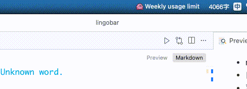

# Lingobar

`Lingobar` 是一个面向 macOS 的菜单栏翻译工具。应用会监听剪贴板中的文本变化，在低打扰的前提下完成翻译、菜单栏预览、可选回写剪贴板，以及本地统计。

## 功能特性

- macOS 15+ 菜单栏常驻翻译应用
- 自动监听剪贴板文本变化并翻译
- 菜单栏实时状态反馈与译文预览
- 可选自动回写剪贴板
- 本地翻译统计
- 设置页支持自定义配置，自动保存并即时生效

## 效果预览



## 安装

前往 [Releases](../../releases) 页面下载最新的 DMG 文件，打开后将 `Lingobar.app` 拖入 `Applications` 文件夹即可。

## 首次打开

应用尚未使用 Apple 开发者证书签名，macOS Gatekeeper 会阻止从网上下载的未签名应用。

**方法一** — 右键点击应用 → 选择"打开" → 在弹窗中点击"打开"（只需一次）。

**方法二** — 前往 **系统设置 → 隐私与安全性**，下滑找到"仍要打开"按钮。

**方法三** — 在终端中移除隔离标记：

```bash
xattr -cr "/Applications/Lingobar.app"
```

以上任一方法操作后，后续即可正常打开。

## 系统要求

- macOS 15+
