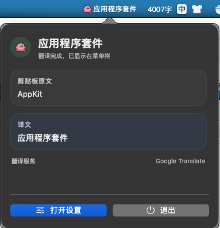

# Lingobar 开发者文档

`Lingobar` 是一个面向 macOS 的菜单栏翻译工具。应用会监听剪贴板中的文本变化，在低打扰的前提下完成翻译、菜单栏预览、可选回写剪贴板，以及本地统计。

本文档面向开发者和维护者，重点说明仓库结构、本地开发、构建测试和发布流程。

## 项目简介

### 项目是什么

- 一个 `macOS 15+` 菜单栏常驻翻译应用
- 宿主使用 `SwiftUI + AppKit`
- 翻译内核参考 `read-frog` 的 provider / 队列 / 缓存语义移植
- 支持菜单栏状态反馈、设置页、统计、自动翻译、可选自动回写剪贴板

### 当前能力边界

- 已实现本地菜单栏应用与设置窗口
- 已实现剪贴板监听、防抖、翻译、回写、统计链路
- 已实现多类 provider 抽象与基础执行器
- 已实现单元测试、工作流测试、UI 测试
- Release 目前产出 **未签名 DMG**，不包含 Apple 签名和 notarization

### 技术栈概览

- `Swift 6`
- `SwiftUI`
- `AppKit`
- `XcodeGen`
- `Swift Package Manager`
- `SQLite + GRDB`
- `UserDefaults + Keychain`
- `GitHub Actions`

## 效果预览

<video src="public/example.mp4" controls width="400"></video>



## 仓库结构

```text
App/
  Sources/                  # 宿主应用、菜单栏 UI、设置窗口、图标加载
  Resources/                # 菜单栏 SVG 等资源
  Assets.xcassets/          # App Icon 等资源
  Tests/LingobarUITests/    # UI 自动化测试

Packages/LingobarKit/
  Sources/LingobarDomain/         # 领域模型与配置类型
  Sources/LingobarApplication/    # 业务编排、队列、翻译协调器
  Sources/LingobarInfrastructure/ # 持久化、Provider、系统接入
  Sources/LingobarTestSupport/    # 测试替身
  Sources/LingobarVerification/   # 快速验证执行器
  Tests/                          # Package 层测试

docs/
  source-mapping.md         # 上游 read-frog 到当前工程的映射说明

scripts/
  generate_app_icons.swift  # App icon 生成脚本
  build-release-dmg.sh      # Release DMG 构建脚本

project.yml                 # XcodeGen 源配置
Lingobar.xcodeproj/         # 生成后的 Xcode 工程
```

## 环境要求

- macOS `15+`
- Xcode `26.4+`
- Swift `6`
- `xcodegen`

可以先检查本机环境：

```bash
xcodebuild -version
swift --version
xcodegen --version
```

如果本机还没有 `xcodegen`：

```bash
brew install xcodegen
```

## 本地开发

### 1. 生成工程

当你第一次拉起仓库，或者修改了 `project.yml` 之后，需要重新生成工程：

```bash
xcodegen generate --spec project.yml
```

注意：`Lingobar.xcodeproj` 是从 `project.yml` 生成出来的，工程结构修改应以 `project.yml` 为准。

### 2. 解析依赖

推荐使用项目内的 package 缓存目录，而不是依赖 Xcode 全局缓存：

```bash
xcodebuild -resolvePackageDependencies \
  -project Lingobar.xcodeproj \
  -scheme Lingobar \
  -clonedSourcePackagesDirPath .xcode-source-packages
```

### 3. 在 Xcode 中运行

```bash
open Lingobar.xcodeproj
```

常用 target / scheme：

- `Lingobar`：宿主应用
- `LingobarUITests`：UI 测试
- `Packages/LingobarKit`：Package 层单元测试、工作流测试、验证器

### 4. Debug / Release 差异

当前工程为了兼顾本地调试和真实菜单栏行为，区分了两种运行模式：

- `Debug`
  - `LSUIElement = NO`
  - 会以普通应用窗口模式运行
  - 方便本地调试和 `XCUITest`
- `Release`
  - `LSUIElement = YES`
  - 会以菜单栏 agent app 方式运行
  - 不出现在 Dock

如果你想验证最终菜单栏常驻形态，请使用 `Release` 构建。

### 5. 菜单栏调试说明

- 当前菜单栏 UI 采用 `NSStatusItem + NSPopover`
- 长文本预览会在弹层中使用固定高度 + 滚动区展示
- 设置窗口和菜单弹层都会跟随应用主题配置变化
- 设置项现在默认是**自动保存并即时生效**，`保存` 按钮只是手动兜底

## 构建与测试

### Debug 构建

```bash
xcodebuild build \
  -project Lingobar.xcodeproj \
  -scheme Lingobar \
  -configuration Debug \
  -destination 'platform=macOS' \
  -clonedSourcePackagesDirPath .xcode-source-packages \
  -derivedDataPath .xcode-derived-data-menu
```

Debug 产物路径：

```text
.xcode-derived-data-menu/Build/Products/Debug/Lingobar.app
```

### Release 构建

```bash
xcodebuild build \
  -project Lingobar.xcodeproj \
  -scheme Lingobar \
  -configuration Release \
  -destination 'platform=macOS' \
  -clonedSourcePackagesDirPath .xcode-source-packages \
  -derivedDataPath .xcode-derived-data-release
```

Release 产物路径：

```text
.xcode-derived-data-release/Build/Products/Release/Lingobar.app
```

### 全量测试

CI 和本地都建议拆成两段执行：

```bash
swift test --package-path Packages/LingobarKit

xcodebuild test \
  -project Lingobar.xcodeproj \
  -scheme Lingobar \
  -destination 'platform=macOS' \
  -only-testing:LingobarUITests \
  -clonedSourcePackagesDirPath .xcode-source-packages \
  -derivedDataPath .xcode-derived-data-menu
```

这样分开的原因是：

- `LingobarKit` 内部测试由 SwiftPM 原生执行，避免把 package 测试文件重复编进宿主工程 target
- `LingobarUITests` 继续通过 `xcodebuild` 运行，保留真实宿主和菜单栏窗口行为验证

其中：

- `swift test --package-path Packages/LingobarKit`
  - 跑 package 层单元测试、工作流测试、基础设施测试
- `xcodebuild test ... -only-testing:LingobarUITests`
  - 只跑宿主应用 UI 测试

### 快速验证

日常改逻辑后，也可以先跑 package 层验证器：

```bash
swift run --package-path Packages/LingobarKit LingobarVerification
```

它主要覆盖：

- provider 配置和分类
- request queue
- batch queue
- translation cache
- clipboard workflow
- provider contract
- SQLite roundtrip

### 常见失败排查

#### `xcodebuild test` UI 测试被前台窗口打断

macOS UI 测试对当前前台窗口很敏感。如果浏览器、终端或其他应用抢焦点，UI 测试可能失败。重跑前尽量保持桌面环境干净。

#### 修改了 `project.yml` 但工程没生效

重新执行：

```bash
xcodegen generate --spec project.yml
```

#### Package 依赖异常

重新解析依赖：

```bash
xcodebuild -resolvePackageDependencies \
  -project Lingobar.xcodeproj \
  -scheme Lingobar \
  -clonedSourcePackagesDirPath .xcode-source-packages
```

## 发布说明

### 版本号来源

版本号以 **Git tag** 为唯一来源。

约定格式：

```text
v0.1.0
v0.2.3
v1.0.0
```

GitHub Actions 在 release 构建时会从 tag 中提取版本号，例如：

- tag：`v0.1.0`
- 版本号：`0.1.0`

构建时通过 `xcodebuild` 动态注入：

- `MARKETING_VERSION=0.1.0`
- `CURRENT_PROJECT_VERSION=<GitHub Actions run number>`

因此当前不需要在仓库里手动维护独立版本文件。

### 自动 Release 流程

仓库内新增了：

```text
.github/workflows/release.yml
```

触发方式：

- push 一个匹配 `v*` 的 tag

workflow 行为：

1. checkout 仓库
2. 安装 `xcodegen`
3. 生成 Xcode 工程
4. 解析 Swift Package 依赖
5. 执行全量测试
6. 以 `Release` 配置构建 `Lingobar.app`
7. 调用脚本生成 DMG
8. 创建 GitHub Release
9. 上传 DMG 作为 release asset

### DMG 产物说明

当前 release 产物为 **未签名 DMG**。

约定：

- 文件名：`Lingobar-vX.Y.Z-unsigned.dmg`
- 内容：仅包含 `Lingobar.app`
- 打包方式：`hdiutil create`

当前**不包含**：

- Apple code signing
- notarization
- stapler

因此用户在下载后，macOS 可能提示”来源未验证”或需要手动允许打开。

### 首次打开未签名应用

应用尚未使用 Apple 开发者证书签名，macOS Gatekeeper 会阻止从网上下载的未签名应用。

**方法一** — 右键点击应用 → 选择”打开” → 在弹窗中点击”打开”（只需一次）。

**方法二** — 前往 **系统设置 → 隐私与安全性**，下滑找到”仍要打开”按钮。

**方法三** — 在终端中移除隔离标记：

```bash
xattr -cr “/Applications/Lingobar.app”
```

以上任一方法操作后，后续即可正常打开。

### 本地验证 release 打包

你可以用下面的命令在本地验证 release 产物：

```bash
./scripts/build-release-dmg.sh 0.1.0 ./dist 1
```

执行完成后，脚本会输出 DMG 路径，例如：

```text
./dist/Lingobar-v0.1.0-unsigned.dmg
```

## 维护约定

### `project.yml` 与 `Lingobar.xcodeproj`

- `project.yml` 是工程源配置
- `Lingobar.xcodeproj` 是生成产物
- 修改 target / build settings / 资源声明时，应优先修改 `project.yml`

### 如何更新图标与资源

- App icon 资源位于 `App/Assets.xcassets`
- 菜单栏 SVG 位于 `App/Resources/LingobarMenuIcon.svg`
- 如果需要重新生成 app icon，可使用：

```bash
swift scripts/generate_app_icons.swift
```

### 如何扩展 provider

一般改动路径：

- `LingobarDomain`：新增 provider 类型与配置
- `LingobarApplication`：接入业务编排
- `LingobarInfrastructure`：补执行器或凭据读取
- `LingobarTestSupport` / `Tests`：补回归测试

### 如何扩展 UI

菜单栏和设置页主要位于：

- `App/Sources/MenuBarStatusItemController.swift`
- `App/Sources/MenuBarContentView.swift`
- `App/Sources/SettingsRootView.swift`

如果改的是工程配置、资源或 target 声明，记得重新生成 `xcodeproj`。

### 如何扩展测试

建议顺序：

1. 先补 `LingobarKit` 层的单元 / 工作流测试
2. 再补 `LingobarUITests`
3. 最后用 `xcodebuild test` 做全量回归

## 参考命令清单

```bash
# 生成工程
xcodegen generate --spec project.yml

# 解析依赖
xcodebuild -resolvePackageDependencies \
  -project Lingobar.xcodeproj \
  -scheme Lingobar \
  -clonedSourcePackagesDirPath .xcode-source-packages

# Debug 构建
xcodebuild build \
  -project Lingobar.xcodeproj \
  -scheme Lingobar \
  -configuration Debug \
  -destination 'platform=macOS' \
  -clonedSourcePackagesDirPath .xcode-source-packages \
  -derivedDataPath .xcode-derived-data-menu

# 全量测试
xcodebuild test \
  -project Lingobar.xcodeproj \
  -scheme Lingobar \
  -destination 'platform=macOS' \
  -clonedSourcePackagesDirPath .xcode-source-packages \
  -derivedDataPath .xcode-derived-data-menu

# 本地生成未签名 DMG
./scripts/build-release-dmg.sh 0.1.0 ./dist 1
```
